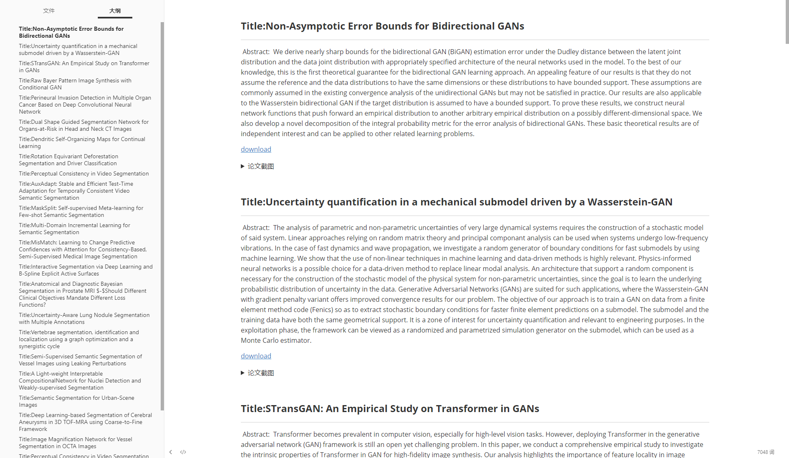
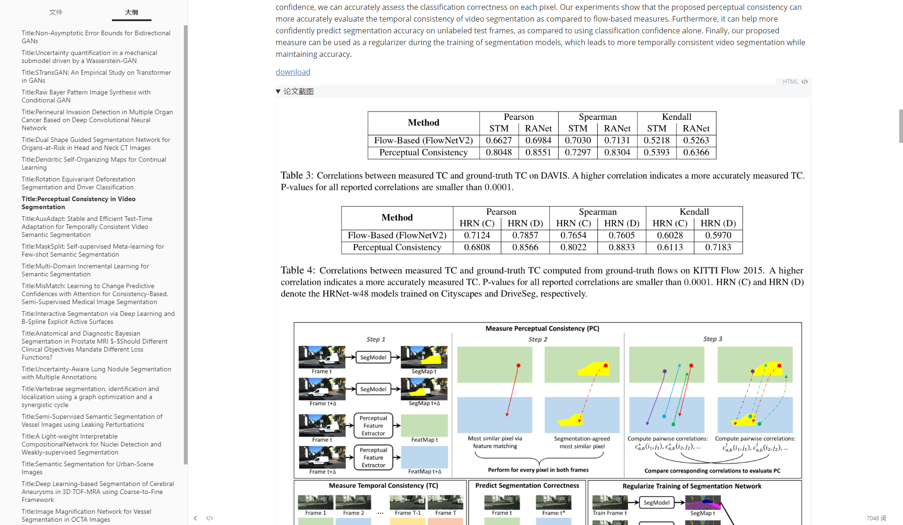

# FocusAX
按关键词筛选arxiv每日最新paper或从arxiv搜索。
- 自动下载、获取摘要、自动截取文中表格和图片。

## 安装必要的环境
- 安装 paddle
  
```angular2html
# GPU安装
python3 -m pip install paddlepaddle-gpu==2.1.1 -i https://mirror.baidu.com/pypi/simple

# CPU安装
 python3 -m pip install paddlepaddle==2.1.1 -i https://mirror.baidu.com/pypi/simple
```
- 安装 Layout-Parser
```angular2html
pip3 install -U https://paddleocr.bj.bcebos.com/whl/layoutparser-0.0.0-py3-none-any.whl
pip install "paddleocr>=2.2"
```
- 按照其他必要的包
```angular2html
pip3 install -r requirements.txt
```
- 下载模型权重
- 将[PubLayNet](https://paddle-model-ecology.bj.bcebos.com/model/layout-parser/ppyolov2_r50vd_dcn_365e_publaynet.tar) 下载解压后放置在**paperparse**目录下。目录结构如下

```
FocusAX
    - paperparse
        - ppyolov2_r50vd_dcn_365e_publaynet
            - inference.pdiparams
            - inference.pdiparams.info
            - inference.pdmodel
        - ...
    - downloader
        - ...
    - utils
        - ...
    - configs.py
    - focus_daily.py
    - focus_search.py
    - README.py
    - ...
```
## 使用教程

- **configs.py** ：程序参数配置文件

```python
# =============== 网络代理 ================
# proxy = None # 不使用代理
proxy = {"http": "socks5://127.0.0.1:8080", "https": "socks5://127.0.0.1:8080"}
# =============== 保存文件根目录 ================
root_path = "./arxiv"
# =============== DNN模型推理配置信息 ================
threshold = 0.5
enable_mkldnn = True
enforce_cpu = True
thread_num = 4
```
- **focus_daily.py** ：按关键字过滤arxiv daily上的文章（仅当日）

```python
if __name__ == '__main__':
    key_words = ['GAN'] # 要包含的关键词
    subject_words = ['ML', 'CV', 'AI']  # 要包含的类别
    start_parse(key_words, subject_words, needPDF=True, needZip=False)
```

- **focus_search.py** ：按关键字在arxiv检索
```python
start_parse('Keyword')
```
- **root_path** 目录中将创建新的文件夹保存结果

## 效果图
每个文件夹中的`abs.md`文件保留的是当前pdf的介绍，使用**Typora**等markdown编辑器打开。




ps:论文排版不规范会导致截图混乱。

## 其他
- 服务器端推理版本（前后端分离）https://github.com/wmpscc/ArxivDailyOverview
